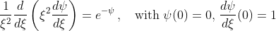

# Bonnor-Ebert

Bonnor-Ebert is a simple C++ program that solves the Bonnor-Ebert differential equation:

## License

Bonnor-Ebert is free software, and it is released under version 3 of the [GNU General Public License](https://www.gnu.org/licenses/gpl-3.0.html).
